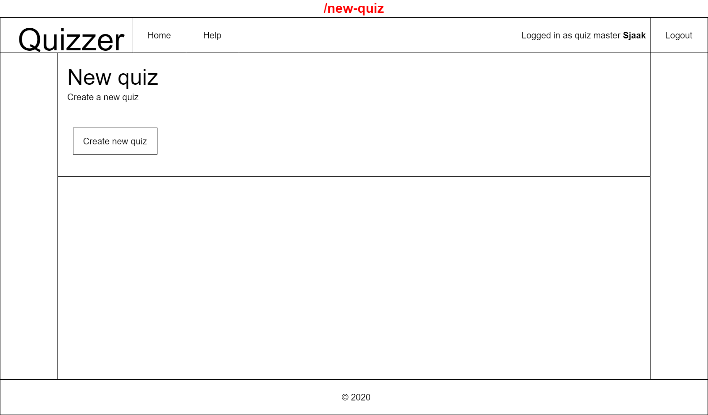
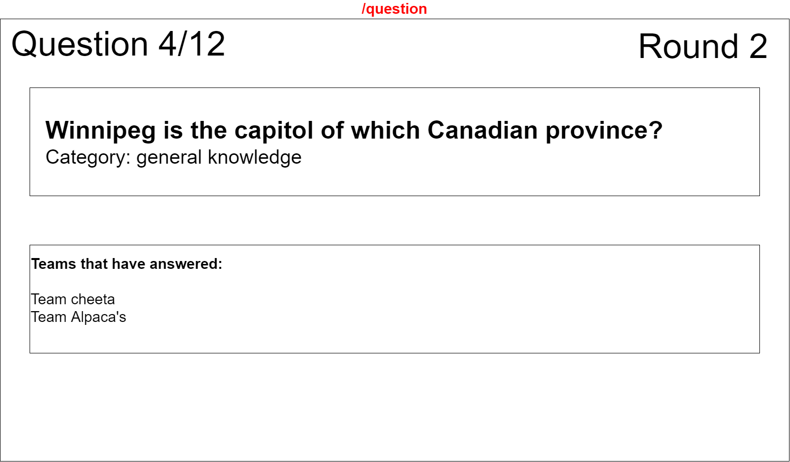

 # Wireframes
These wireframes show, in general, how a page will look.

Most pages have a navbar with a link to the homepage, a help page, an idication who is logged in and an sign in/out button.

## Quizmaster app
 ### Answer page
On this page the quiz master, when logged in, can see the correct answer of the current question. They can also see the answers submitted by the teams and approve or disapprove them. When all answers have been (dis)approved the quiz master can submit the answers so that the teams can see them.
 

 ### New quiz page
 When the quiz master is logged in they can start a new quiz, generating a new room.
 

 ### New round page
 On this page the quiz master can start a new round by choosing 3 categories on this page to be used for questions.
 

 ### Questions page
 This page shows 3 questions from the 3 chosen categories. The quiz master can choose whatever question he wants or generate 3 other questions.
 

 ### Sign in page
 On this page the quizmaster can login if they already have an account.
 

 ### Sign up page
 On this page the quizmaster can sign up if they don't have an account yet.
 

 ### Teams applications page
 After creating a new quiz, the quiz master can see the room code and teams that have applied. The quiz master can approve or disapprove teams before starting a new round.
 

## Scoreboard app
 ### Answers page
 This page of the scoreboard shows after all teams have answered a question and the quiz master has (dis)approved all questions. It shows the question, the category, what the teams answers were and if they were correct.
 

 ### Overview page
This page shows the current question and which of the teams have already answered.
 

## Teams app
 ### Questions page
 On this page the team can see the question and submit an answer.
 

 ### Sign up
 On this page users can sign up as a team for a quiz if they have a room code.
 