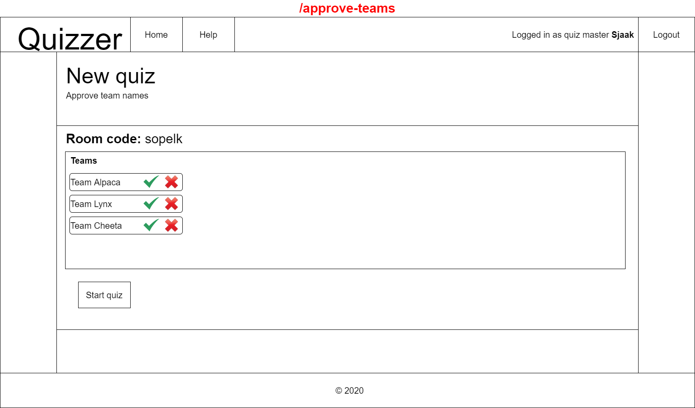
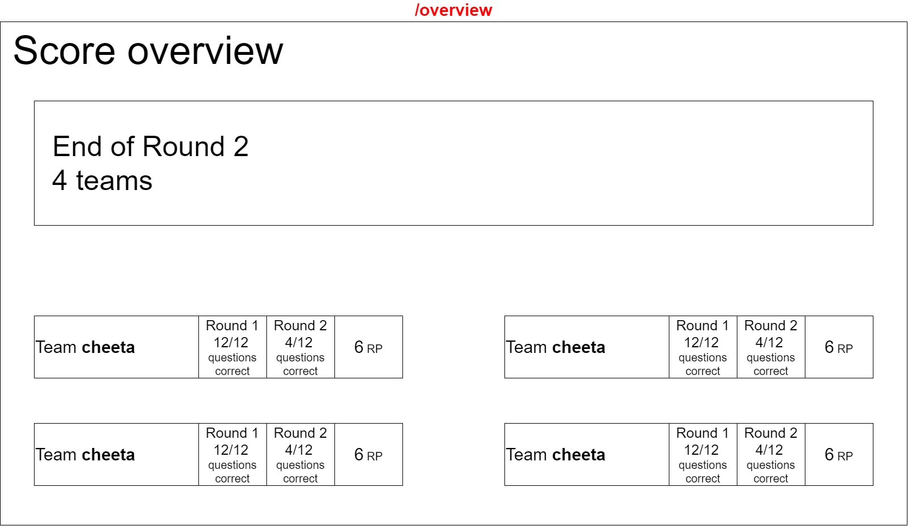
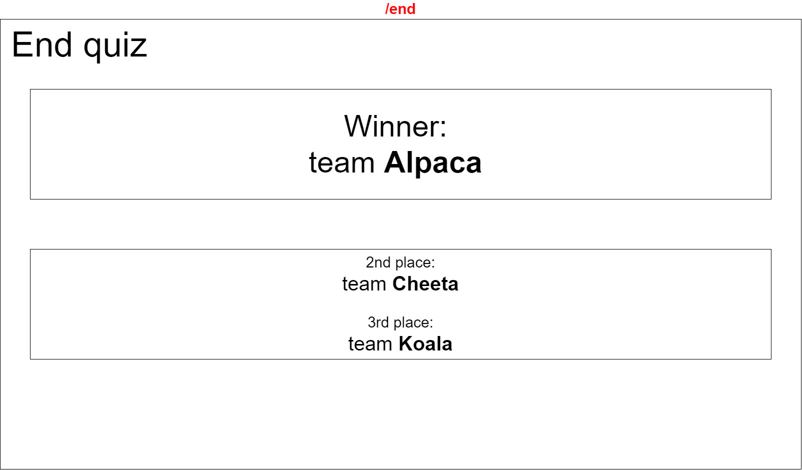
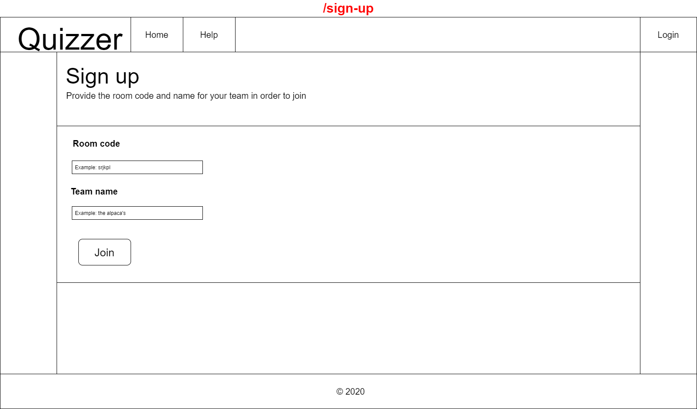

 # Wireframes
These wireframes show, in general, how a page will look.

Most pages have a navbar with a link to the homepage, a help page, an idication who is logged in and an sign in/out button.

## Quizmaster app
 ### New quiz page
 When the quiz master is logged in they can start a new quiz, generating a new room.
 

 ### Teams applications page
 After creating a new quiz, the quiz master can see the room code and teams that have applied. The quiz master can approve or disapprove teams before starting a new round.
 

 ### New round page
 On this page the quiz master can start a new round by choosing 3 categories on this page to be used for questions.
 

 ### Questions page
 This page shows 3 questions from the 3 chosen categories. The quiz master can choose whatever question he wants or generate 3 other questions.
 

 ### Answer page
On this page the quiz master, when logged in, can see the correct answer of the current question. They can also see the answers submitted by the teams and approve or disapprove them. When all answers have been (dis)approved the quiz master can submit the answers so that the teams can see them.
 

 ### New round/ end quiz page
 On this page the quiz master can start a new round or end the quiz.
 

## Scoreboard app
 ### Sign in page
This page allows the scoreboard to join a room

### Waiting for quizmaster page
This page shows when waiting for teams to be approved, questions to be started, etc.

 ### Question page
This page shows the current question and which of the teams have already answered.
 

 ### Answers page
 This page of the scoreboard shows after all teams have answered a question and the quiz master has (dis)approved all questions. It shows the question, the category, what the teams answers were and if they were correct.
 

 ### End round page
 An overview of the scores for at the end of a round.
 

 ### End quiz page
 Page showing the winner of the entire quiz.
 

## Teams app
 ### Sign up
 On this page users can sign up as a team for a quiz if they have a room code.
 

 ### Questions page
 On this page the team can see the question and submit an answer.
 

 ### Waiting for quizmaster
 The page which will show when waiting for the quiz master to approve the teams or start the next question/round
 

 ### End quiz
 This page will show at the end of the quiz allowing teams to see the place they ended up in.
 